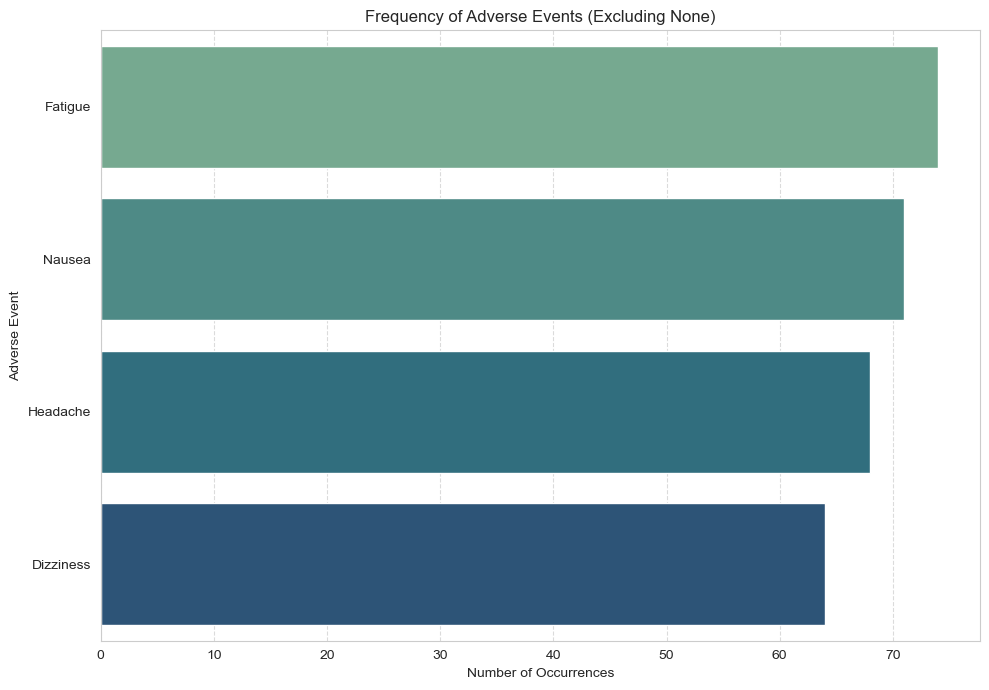

# Clinical Trial Analysis – New Diabetes Medication (Phase III)

## Overview
This project analyses data from a simulated Phase III clinical trial to evaluate the **efficacy** and **safety** of a new diabetes medication compared to placebo.

## Business problem
PharmaTech needs evidence on:
- Whether the medication significantly reduces HbA1c versus placebo
- Whether the effect is consistent over time
- Whether adverse events differ between groups
- Whether demographics or disease duration influence outcomes

## Dataset
- 200 patients (100 treatment, 100 placebo)
- 24-month observation period
- Source file: `diabetes_medication_clinical_trial1_3.csv`

## Approach (what I did)
- Data cleaning (missing values, correct data types)
- Feature engineering (HbA1c change: initial vs final)
- Statistical testing:
  - Independent samples t-test (final HbA1c)
  - Repeated measures analysis (group-by-time effect)
  - Chi-square test (adverse events)
  - Subgroup analysis (age groups, gender)
  - Correlation (disease duration vs HbA1c reduction)
- Visualisations (time trend, boxplot, adverse events, scatter)

## Key findings
- Treatment group achieved a **significantly lower final HbA1c** vs placebo
- HbA1c reduction showed a **clear group-by-time effect** across 24 months
- **No significant difference** in overall adverse event frequency vs placebo
- Effect was **consistent across demographics** (age/gender) and disease duration

  ## Business impact
- Supports regulatory submission and market approval strategy
- Provides evidence for broad patient applicability
- Reduces uncertainty around safety profile

## Deliverables
- Notebook: `diabetes_medication_clinical_trial.ipynb`
- Report (PDF): `Clinical Trial Analysis Report.pdf`

## Screenshots / demo
### HbA1c Trend Over Time

### Final HbA1c Distribution

### Most Common Adverse Events

## Tools
Python, Pandas, NumPy, SciPy, Statsmodels, Matplotlib/Seaborn, Jupyter Notebook

## Next improvements
- Add clearer visual highlights (key chart annotations)
- Add a short executive summary section at the top of the notebook
- Package charts into a single “Results” section for quicker review
